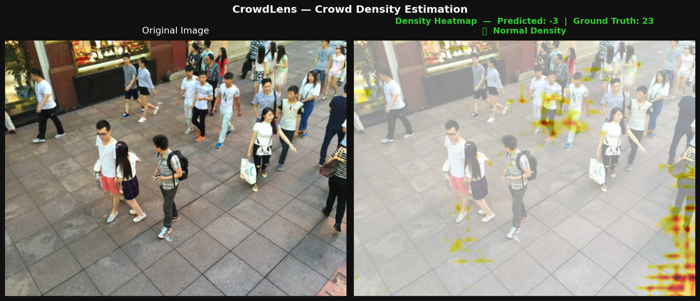
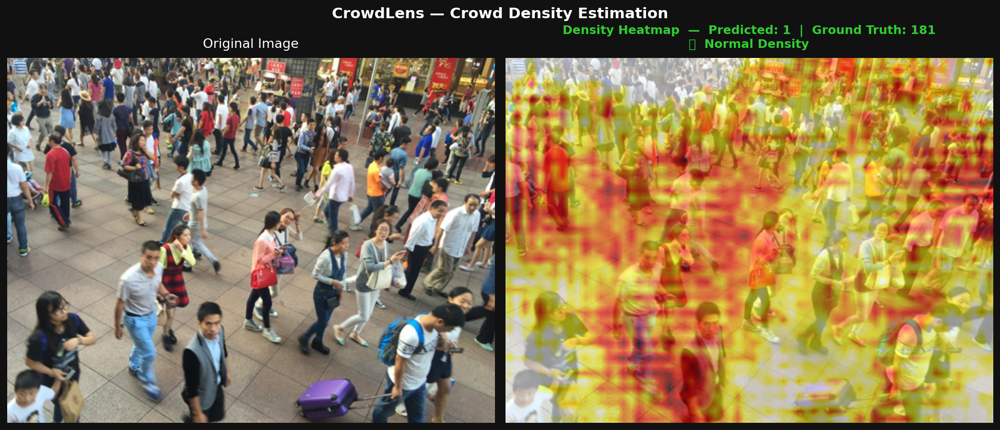
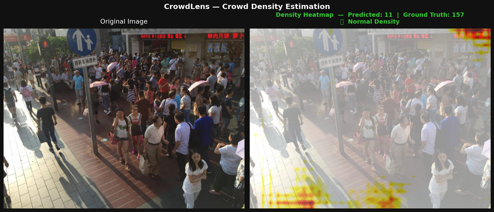
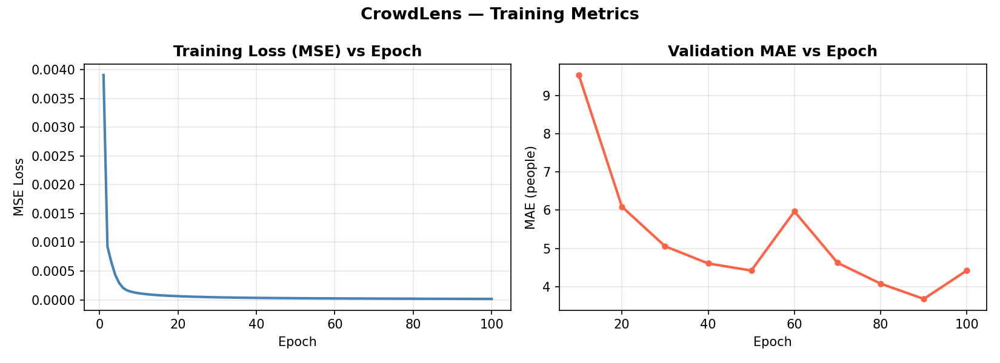

# CrowdLens

Crowd density estimation using CSRNet (CVPR 2018) on ShanghaiTech Part B.

## Problem Statement
Estimating crowd count from a single image is a regression problem — the model
must predict spatial density, not just classify. This has direct applications
in event safety, urban planning, and public surveillance systems.

## Architecture
- **Frontend**: VGG-16 (pretrained on ImageNet) — extracts rich semantic features from crowd images
- **Backend**: 6 dilated convolutional layers (dilation=2, no pooling) — expands receptive field WITHOUT reducing spatial resolution
- **Output**: A 1-channel density map; summing all pixel values gives the estimated crowd count

**Why dilated convolutions?** Standard pooling discards spatial information. Dilated convolutions skip pixels to widen the receptive field while keeping output resolution intact — crucial for generating accurate high-resolution density maps.

**How density maps are built**: A Gaussian kernel (sigma=15) is placed on each annotated head coordinate. The resulting smooth density field, when integrated, equals the total head count.

## Dataset
ShanghaiTech Part B — 400 training images, 316 test images.
Annotations: `.mat` files containing head center coordinates.
Density maps generated offline by applying Gaussian kernels to head annotations.

## Custom Additions
1. **Density heatmap overlay** — predicted density map blended onto original image using hot colormap (black -> red -> yellow)
2. **Crowd alert system** — automatically flags "HIGH DENSITY" if estimated count exceeds threshold of 300
3. **Training curves** — MSE loss and validation MAE plotted per epoch and saved as PNG

## Results
| Metric | Value |
|--------|-------|
| **MAE** (ShanghaiTech Part B) | **3.68** |
| **MSE** (ShanghaiTech Part B) | **4.77** |
| Test images evaluated | 316 |
| Epochs | 100 |
| Optimizer | Adam (lr=1e-6) |
| Device | Apple M2 Pro (MPS) |

## Sample Outputs

## Interview Talking Points
- **Why MAE and not accuracy?** Crowd counting is regression, not classification. MAE directly measures average error in number of people — interpretable and standard for this task.
- **What does VGG-16 contribute?** Pretrained ImageNet features (edges, textures, shapes) give the model strong visual priors without training from scratch.
- **Why no pooling in the backend?** Pooling discards spatial info. Dilated convolutions preserve resolution while expanding context — essential for precise density map generation.

## Reference
Li, Y., Zhang, X., & Chen, D. (2018). CSRNet: Dilated Convolutional Neural Networks
for Understanding the Highly Congested Scenes. CVPR 2018.
